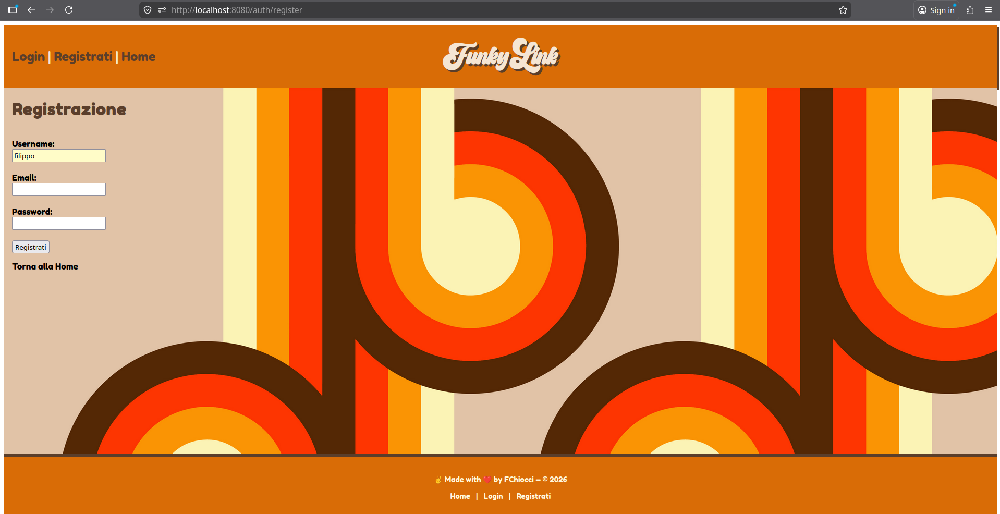
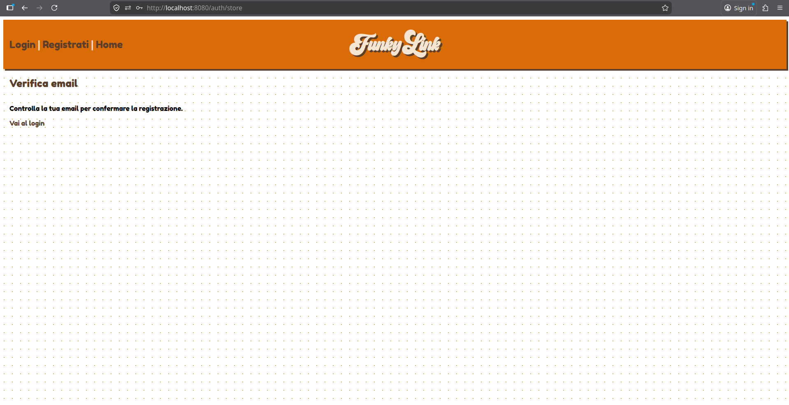
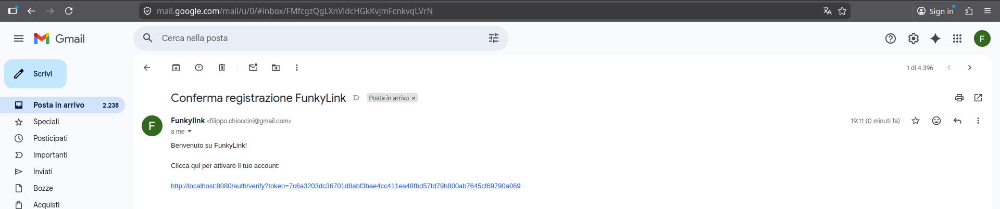
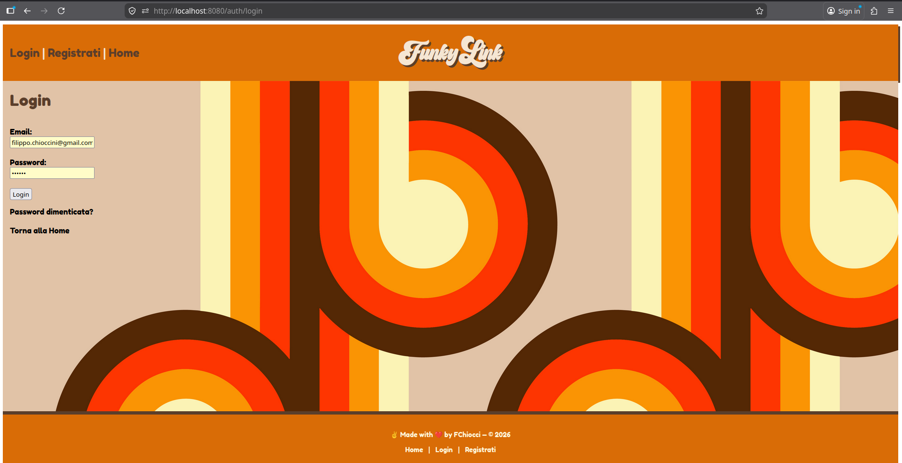
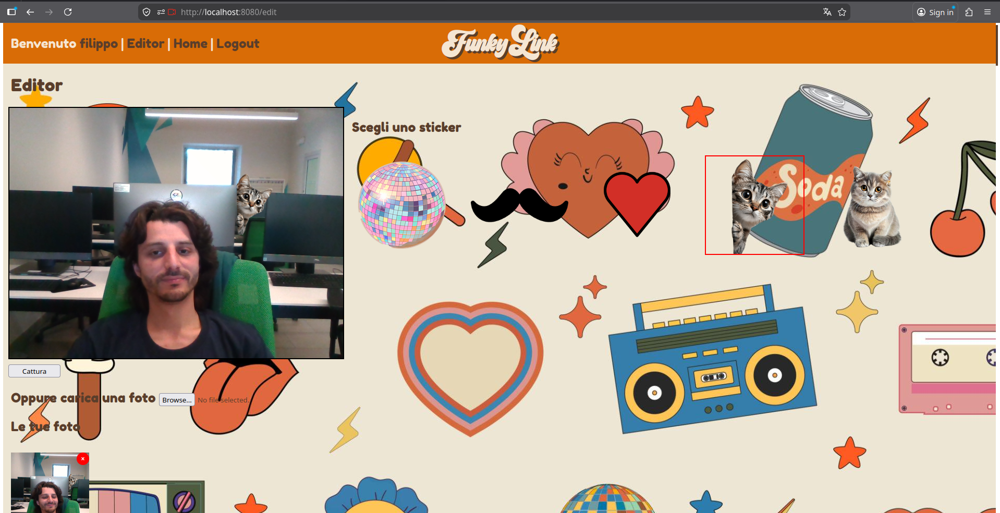
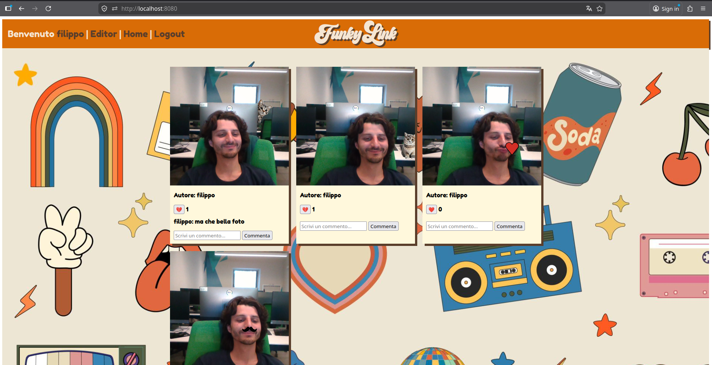
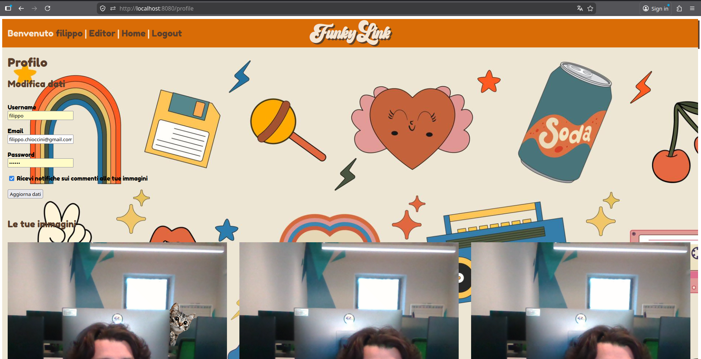

Camagru - Applicazione Web di Photo Editing

Progettazione e sviluppo di una web application in PHP e JS, struttura MVC, che consente agli utenti di scattare o caricare immagini e applicare overlay grafici lato server. 
Implementato un sistema completo di autenticazione (registrazione con conferma email, login, reset password) e una galleria pubblica con funzionalità di like e commenti, inclusa notifica automatica via email.
Sviluppata la composizione delle immagini lato server e gestita la persistenza tramite database SQL, con particolare attenzione alla sicurezza di SQL injection, XSS e CSRF. 
 Registrazione  

  Login  

  Editor  

  Home Gallery  

  Gestione profilo  

